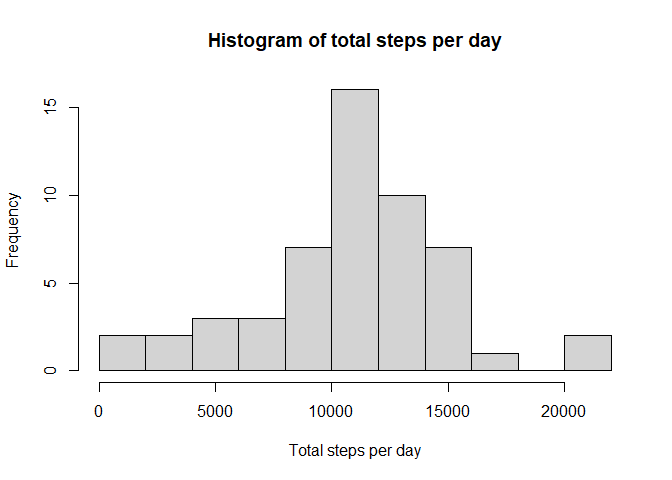
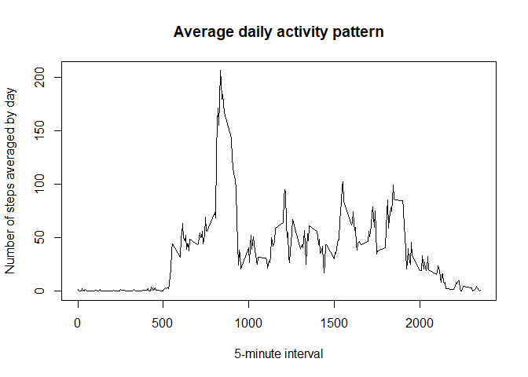
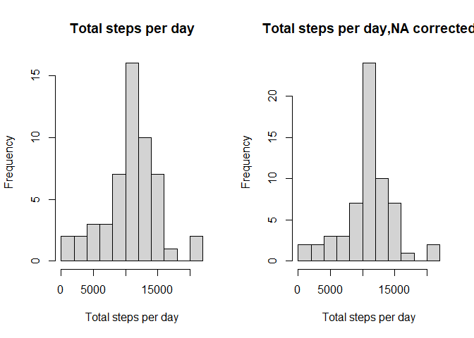
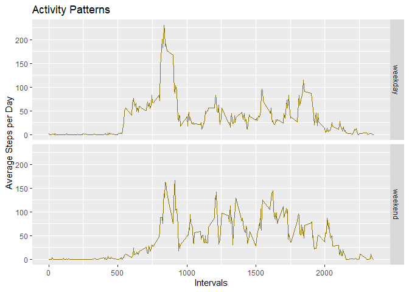

 
## Loading and preprocessing the data

Fist we read in the data and reformat the date column


```r
activity <- read.csv(unzip("activity.zip"))
activity$date <- as.Date(activity$date)
```


## What is mean total number of steps taken per day?

We use dplyr package to group data by date and sum steps in these groups. Resulting data on total steps per day is saved in tspd (total steps per day) data frame.


```r
library(dplyr)
tspd <- activity %>% 
        group_by(date) %>%
        summarize(total_steps_per_day = sum(steps))

#Note that we DO NOT use na.rm = TRUE in sum here. The reason is, this condition will replace total steps per day for days
#with no data with 0 and therefore will contribute significantly to mean and median value

hist(tspd$total_steps_per_day,breaks = 10, main = "Histogram of total steps per day", xlab = "Total steps per day")
```

<!-- -->

```r
mean_tspd <- mean(tspd$total_steps_per_day, na.rm = TRUE)
median_tspd <- median(tspd$total_steps_per_day, na.rm = TRUE)
#reformat mean and median
format_mean_tspd <- format(mean_tspd, digits = 0, scientific = FALSE)
format_median_tspd <- format(median_tspd, digits = 0, scientific = FALSE)
```
Please note that we conciously DO NOT use na.rm = TRUE in sum here. The reason is, this condition will replace total steps per day for days with no data with 0 and therefore will contribute significantly to mean and median value (as number of days will be larger while sum will not change). We use na.rm = TRUE for mean and median functions directly instead.

Therefore, mean total number of steps per day is 10766 and median total number of steps per day is 10765

## What is the average daily activity pattern?
 We use the same method to group the data by an interval and then average by day. The data is saved in aspi (average steps per interval) data frame.
 

```r
aspi <- activity %>% 
        group_by(interval) %>%
        summarize(averaged_steps_per_interval = mean(steps, na.rm = TRUE)) 
plot(aspi$interval, aspi$averaged_steps_per_interval, main = "Average daily activity pattern", type = "l",
     xlab = "5-minute interval", ylab = "Number of steps averaged by day")
```

<!-- -->

```r
max_aspi <- aspi$interval[which.max(aspi$averaged_steps_per_interval)]
```
Therefore, the maximum steps were taken in 835 interval.

## Imputing missing values

 In the original data some rows contain NA intead of step number. We now determine NA number.

```r
sum(is.na(activity))
```

```
## [1] 2304
```

We will now complete missing data with a step number for corresponding interval averaged over all days. This way we keep the daily activity pattern that is of interest for our analysis. 

To implement it we do following steps:

1. Look through activity data for steps and define where NA occurs. Form a list of corresponding
intervals

2. For the interval list from the previous step get a list of corresponding indices in aspi data frame (averaged steps per interval)

3. Get the list of averaged steps per interval for the indices from the previous step

In this way we got the replacement data for the initial NA list and we are now ready to 

4. Copy original data frame and replace the NA list with the data from step 3


```r
#get the list of intervals where NA occurs
na_intervals <- activity$interval[is.na(activity$steps)]
#get the list of corresponding index in aspi data set
na_intervals_aspi_index <- match(na_intervals, aspi$interval)
#get the list of averaged steps for these indices, e.g. the vector that should replace NAs in original data
na_replacement <- aspi$averaged_steps_per_interval[na_intervals_aspi_index]
#copy original data
activity_na_corrected <- activity
activity_na_corrected$steps[is.na(activity_na_corrected$steps)] <- na_replacement

tspd_na <- activity_na_corrected %>% 
        group_by(date) %>%
        summarize(total_steps_per_day = sum(steps)) 
```

```
## `summarise()` ungrouping output (override with `.groups` argument)
```

```r
#Plotting parameters to place previous histogram and new one next to each other
par(mfrow = c(1,2))
#old histogram with NA removed
hist(tspd$total_steps_per_day,breaks = 10, main = "Total steps per day", xlab = "Total steps per day")
#new histogram with NA replaced 
hist(tspd_na$total_steps_per_day,breaks = 10, main = "Total steps per day,NA corrected", xlab = "Total steps per day")
```

<!-- -->

```r
mean_tspd_na <- mean(tspd_na$total_steps_per_day)
median_tspd_na <- median(tspd_na$total_steps_per_day)
#reformat mean and median
format_mean_tspd_na <- format(mean_tspd_na, digits = 0, scientific = FALSE)
format_median_tspd_na <- format(median_tspd_na, digits = 0, scientific = FALSE)
```

Therefore, mean total number of steps per day for NA corrected data frame is 10766 and median total number of steps per day is 10766 to compare with previous values of 10766 and  10765. As we see, mean and median values did not visibly change. The only significant difference for histograms is frequency of the mean total steps value as we replaced NA with effectively these data.

## Are there differences in activity patterns between weekdays and weekends?
 
To answer this question we add a factor variable to our data set that indicates whether a day is a weekday or weekend (determine it with chron package). Then process data as before and plot patterns


```r
library(chron)
```

```
## Warning: package 'chron' was built under R version 4.0.3
```

```r
# add factor weekday for weekday or weekend
activity_na_corrected$wday <- ifelse(is.weekend(activity$date), "weekend", "weekday")
# get aspi data frame with weekday factor
aspi_na_wday <- activity_na_corrected %>% 
        group_by(interval, wday) %>%
        summarize(total_steps_per_day = mean(steps)) 
# plot activity patterns
library(ggplot2)
```

```
## Warning: package 'ggplot2' was built under R version 4.0.3
```

```r
plot <- ggplot(aspi_na_wday, aes(interval, total_steps_per_day))
plot + geom_line(color = "gold4") + facet_grid(wday~.) + labs(x = "Intervals", y = "Average Steps per Day",
title = "Activity Patterns")
```

<!-- -->

As can be seen, the patterns look rather similar except that activity starts earlier on weekdays (as expected). There is also a late spike for weekend activity indicating that some people have some interesting life on these days.

